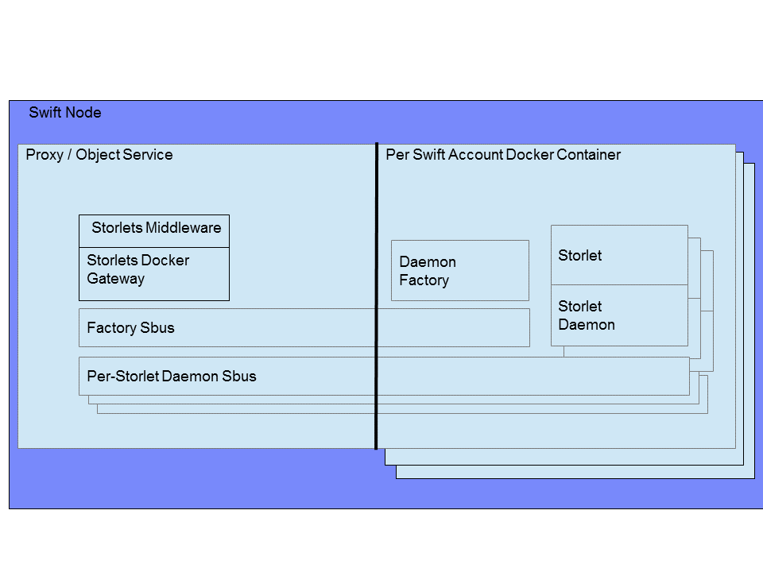

=====================
Docker Compute Engine
=====================

The Docker compute engine makes use of Docker containers to sandbox execution of Storlets. The engine is designed to reuse Docker containers and processes within them to minimize the latency of Storlets invocations.

To facilitate multi-tenancy the engine holds a Docker image per Swift account. The engine is made of the following components as depicted in the figure below:

#. The Storlet middleware running the StorletsDockerGateway class implementing the StorletsGateway interface.
#. The Storlet daemon. A Java based generic daemon that when spawned, loads dynamically the Storlet code, initiates a thread pool to process requests and listens for invoke commands coming from the StorletDockerGateway class.
#. The daemon factory. This is the Docker container main process that manages the Storlet daemons lifetime. The factory listens for commands coming from the StorletDockerGateway class.
#. SBus. The Storlets bus. A communication mechanism based on unix domain sockets used to pass commands and file descriptors from the StorletDockerGateway to the factory and Storlet daemons. There are two types of SBus instances:

  #. SBus connecting the StorletsDockerGateway to the daemon factory. There is an instance of this type of SBus per account's Docker container.
  #. SBus connecting the StorletsDockerGateway to each Storlet daemon.

