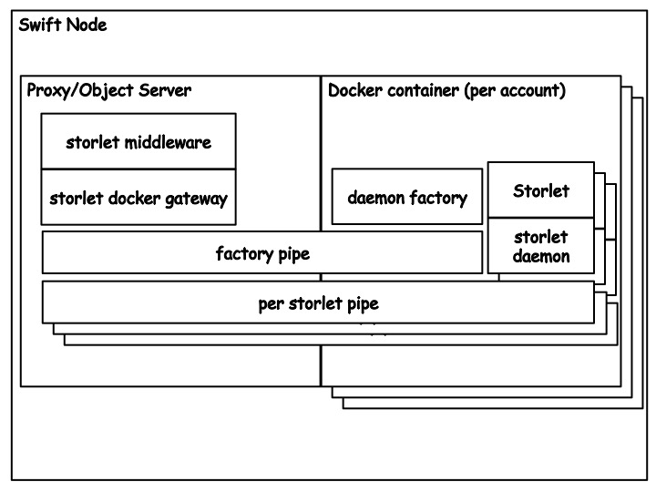

Storlet Engine Overview
=======================
At the high level the storlet engine is made of the components described below. See illustration.

The storlet middleware
----------------------
The storlet middleware is a Swift WSGI middleware that intercepts storlet invocation
requests and routes the input data and the computation output into and out of the Docker
container where the storlet is executed. This middleware needs to be in both the
proxy-server and the object-server pipelines.

The storlet middleware is written in a way that allows to extend the engine
to support sandboxing technologies other then Docker. This manifests
in the "storlet gateway" API which defines the functionality required from a
sandbox to run storlets.
Moreover, part of the storlet middleware configuration is what
"storlet gateway" implementation class to load. Currently, we have a single
class implementation of the API we refer to as "storlet docker gateway".

Swift accounts
--------------
The storlet engine is tightly coupled with accounts in Swift in the following manners:

#. In order to invoke a storlet on a data object residing in some Swift account, that account
   must be enabled for storlets. That is, it must have a designated user defined metadata flag
   on the account set to true.
#. Each Swift account must have certain containers required by the engine. One such container
   is the "storlet" container, where storlets are being uploaded. Storlets uploaded to this
   container can be invoked on any data object in that account, given that the invoking user
   has read permissions to the "storlet" container.
#. Each account has a separate Docker image (and container) where storlets are being executed.
   All the storlets being executed on data objects belonging to same account, will be executed
   in the same Docker container. This facilitates having different images for different Swift
   accounts. The Docker image name must be the account id to which it belongs.

The Docker image
----------------
As mentioned above there is a Docker image per account that is enabled for storlets.
At a high level this image containes:

#. A Java run time environment. This is needed when you run storlets written in Java
#. A daemon factory. A Python process that starts as part of the Docker container bring up.
   This process spawns the "per storlet daemons" upon a request from the "storlet docker
   gateway" that runs in the context of the storlet_middleware.
#. A storlet daemon. The storlet daemon is a generic daemon that once spawned loads a
   certain storlet code and awaits invocations. Different storlets, e.g. a filtering storlet
   and a compression storlet are loaded into different daemons. A daemon is invoked the first
   time a certain storlet needs to be executed. Currently we have two types of daemons, a Java
   daemon for loading and running Java written storlets, and a Python daemon for loading and
   runding Python written storlets.
#. The storlet common jar. This is the jar used for developing storlets in Java. Amongst
   other things it has the definition of the invoke API the storlet must implement.

The storlet bus
---------------
The storlet bus is a communication channel between the storlet middleware in the Swift side 
and the factory daemon and storlet daemon in the Docker container.
For each Docker container (or Swift account) there is a communication channel with the storlet factory of that container.
For each storlet daemon in the container there is a communication channel on which is listens for invocations. These channels are
based on unix domain sockets.

The storlet engine components illustration
------------------------------------------

Flow
====

To tie everything together we illustrate an end-to-end scenario.

Writing and Deploying a storlet
-------------------------------
The flow begins with writing a storlet followed by deploying it.
writing and deploying a storlet is covered in the writing and
deploying storlets guide_.

.. _guide: writing_and_deploying_storlets.html

Invoking a Storlet
------------------
A Storlet can be invoked on object download, upload or copy operations (GET, PUT, and COPY respectively).
For the flow description lets assume that we wish to invoke the
storlet on an object download. This involves doing a Swift GET request with the
additional header "X-Run-Storlet" which specifies the storlet to invoke,
e.g. "X-Run-Storlet: compress-1.0.jar".

Handling the request at the proxy server
----------------------------------------
Seeing the "X-Run-Storlet" header the storlert_middleware at the proxy intercepts
the request and performs a HEAD on the storlet specified by the user.
This HEAD operation facilitates:

#. Enforcing execution rights: Having access to the storlet container means that
   the user is allowed to invoke storlets. If the HEAD fails then the engine
   returns HTTP Unauthorized.
#. Getting the storlet metadata. This metadata is later used to validate that the
   actual code being executed is the most updated code.

Once the HEAD succeeds, the storlet middleware adds the storlet metadata to the request
and lets the request continue to flow through the proxy pipeline. The pipeline ends with
with the request being routed to an object server that holds a replica of the object
specified in the GET uri.

Handling the request at the object server
-----------------------------------------
Seeing the "X-Run-Storlet" header the storlert_middleware at the object server intecepts
the request and perform the following two phased flow:

Phase one
---------
The first phase has to do with making sure there is a local storlet daemon running inside
a Docker container for the appropriate account. In this phase the middleware performs the
following:

#. Checks whether there is a running Docker container for the account appearing in the
   request uri. If there isn't one, the middleware tried to spawn it.
#. Checks whether there is a local updated copy of the required storlet to execute.
   If there is no local copy or the copy is not up-to-date the middleware initiates
   an internal GET request for bringing it from the "storlet" container.
#. If the local copy is updated, the middleware checks whether there is a running
   daemon for that storlet in the container. This is done by querying the storlet
   daemon over a named pipe called "factory pipe".
#. In case there is no running daemon the middleware asks the factory to spawn one
   for it. Once spawned the daemon start listening on a designated named pipe for
   invocations.

Phase two
---------
In the second phase the middleware actually invokes the storlet over the request.
Once there is a daemon running the middleware proceeds as follows:

#. The middleware lets the request to continue flowing through the object server
   pipeline, until it gets a response. The response carries a descriptor through
   which the object data can be accessed.
#. The middleware uses the storlet daemon named pipe to do the actual invocation
   of the storlet. The actual invocarion is done by passing along the pipe a descriptor
   carrying the object data as well as a descriptor for the storlet to write its output,
   and another descriptor for the storlet logs.
#. Once the storlet starts writing results to the output descriptor, the
   sotler_middleware returns a response which carries the storlet's output descriptor
   so that the output can be streamed back to proxy and to the user.

.. note::

  The above is a simplification that highlights the major work done by the storlet engine.

.. note::

  There are cases where the storlet is executed on the proxy. One such case is a PUT request.
  Executing a storlet on the proxy involves pretty much the exact steps described above.
