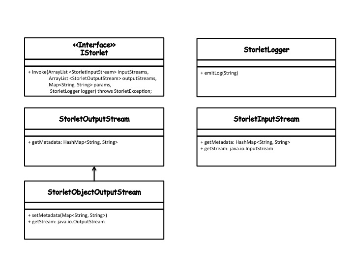

Java Storlet Writing and Deploying Guide
========================================

This is the Java specific storlet writing and deploying guide. This guide complements
the more general_ guide for writing and deploying storlets which should be read first.
To write a Java storlet you will need the SCommon.jar which is being built as part of
the storlets build process as described in the development and testing guide_.

.. _guide: engine_dev_tests.html
.. _general: writing_and_deploying_storlets.html

Import the .jar to a Java project in Eclipse and implement the
org.openstack.storlet.common.IStorlet interface.
The interface has a single method that looks like this:

::

  public void invoke(ArrayList<StorletInputStream> inStreams,
                     ArrayList<StorletOutputStream> outStreams,
                     Map<String,String> parameters, StorletLogger logger) throws StorletException;

Below is a class diagram illustrating the classes involved in the above API.

#. The StorleInputStream is used to stream object's data into the storlet.
   An instance of the class is provided whenever the Storlet gets an object as
   an input. Practically, it is used in all storlet invocation scenarios to
   stream in the object's data and metadata. To consume the data call getStream()
   to get a java.io.InputStream on which you can just read(). To consume the
   metadata call the getMetadata() method.

#. StorletObjectOutputStream. In all invocation scenarios the storlet is
   called with an instance of this class.

   - Use the setMetadata method to set the Object's metadata.

   - Use getStream to get a java.io.OutputStream on which you can just write()
     the content of the object.

   - Notice that setMetadata must be called. Also, it must be called before
     writing the data. Additional guidelines on using StorletObjectOutputStream
     are given below.

#. StorletLogger. The StorletLogger class supports a single method called emitLog,
   and accepts a String. The storlet logs are written to the host machine.

When invoked via the Swift REST API the invoke method
will be called as follows:

#. The inStreams array would include one or more element(s) of type StorleInputStream
   representing the object appearing in the request's URI (and possibly extra resources).

#. The outStreams would include a single element of type StorleObjectOutputStream
   representing the response returned to the user.

#. The parameters map includes execution parameters sent. These parameters can be
   specified in the storlet execution request.

#. A StorletLogger instance.

Tips
----

#. The storlets are executed in an open-jdk 8 environment. Thus, any dependencies
   that the storlet code requires which are outside of open-jdk 8 should be
   stated as storlet dependencies and uploaded with the storlet. Exact details
   are found in the deployment section below.

#. In some cases the storlet may need to know the path where the storlet .jar
   as well as the dependencies are kept inside the Linux container. One reason
   may be the need to invoke a binary dependency. To get that path use the
   following code:

   ::

     // Get the path of this class image
     String strJarPath = StorletUtils.getClassFolder(this.getClass());

Deploying a Java Storlet
------------------------

Below are specific guidelines for deploying a Java storlet:

#. The compiled class that implements the storlet needs to be wrapped in a .jar.
   This jar must not include the SCommon.jar.

#. Any jars that the class implementation is dependent on should be uploaded as separate jars.

#. The name of the  Java storlet being uploaded must be of the form <name>-<version>, e.g.
   identitystorlet-1.0.jar

#. The 'X-Object-Meta-Storlet-Main' metadata key shold be the name of the class implementing
   the IStorlet interface. E.g. "org.openstack.storlet.identity.IdentityStorlet"

Deploying a Java Dependency
---------------------------

#. A java dependency must be either a .jar or an executable
