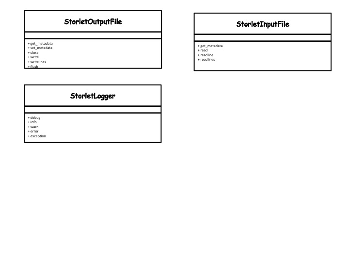

Python Storlet Writing and Deployment Guideline
===============================================

This is the Python specific storlet writing and deploying guide. This guide complements
the more general_ guide for writing and deploying storlets which should be read first.

.. _general: writing_and_deploying_storlets.html

A python module implementing a storlet looks like this:

::

  class <Class name>(object):
      def __init__(self, logger):
          self.logger = logger

      def __call__(self, in_files, out_files, params):
          """
          The function called for storlet invocation
          :param in_files: a list of StorletInputFile
          :param out_files: a list of StorletOutputFile
          :param params: a dict of request parameters
          """

Below is a class diagram illustrating the classes behind the in_files, out_files, and logger.
The diagram lists only the methods that the storlet writer is expected to work with.

#. The StorletInputFile is used to stream object's data into the storlet.
   StorletInputFile has the same read methods as python FileObject.
   Trying to write to a StorletInputFile yields NotImplemented error.
   Whenever a storlet is invoked, an instance of this class is provided.
   To consume the metadata call the StorletInputFile.get_metadata method.

#. The StorleOutputFile is used for writing the storlet output.
   StorletOutputFile has the same write methods as python FileObject.
   Trying to read from a StorletOutputFile yields NotImplemented error.
   Whenever a storlet is invoked, an instance of this class is provided.
   Use the StorletInputFile.set_metadata method to set the Object's metadata.
   Note that the storlet must call the StorletInputFile set_metadata method.
   Moreowver, StorletInputFile.set_metadata must be called before writing
   the data.

#. StorletLogger. The StorletLogger class implements the same log methods as the
   Python logger.

When invoked via the Swift REST API the __call__ method
will be called as follows:

#. The in_files list would include one or more element(s) of type StorleInputFile
   representing the object appearing in the request's URI (and possibly extra resources).

#. The out_files would include a single element of type StorleOutputFile
   representing the response returned to the user.

#. The parameters is a dictionary with the execution parameters sent. These parameters can be
   specified in the storlet execution request.

#. A StorletLogger instance.

Deploying a Python Storlet
--------------------------
Below are specific guidelines for deploying a Python storlet:

#. The object name of the python module containing the storlet class implemetation
   must end with .py

#. Any python modules that the class implementation is dependent on should be uploaded as separate .py(s).

#. The 'X-Object-Meta-Storlet-Main' metadata key shold be of the form: <module_name>.<class_name>. For example,
   if the storlet name is SimpleStorlet and it resides in simple_storlet.py, then the
   'X-Object-Meta-Storlet-Main' metadata key shold be "simple_storlet.SimpleStorlet"

Deploying a Python Dependency
-----------------------------

#. Currently, there is no limitation as to what is being uploaded as a dependency.

Writing Storlet App with IPython/Jupyter Notebook
-------------------------------------------------

Storlets supports IPython/Jupyter Notebookd extension to upload your own
storlet apps with the following steps:

.. note::

  To upload a storlet app to Swift one needs to provide the authentication
  information of the Storlet enabled Swift account. This is done by setting
  environment variables similar to those used by swift client. The exact
  variables that need to be set are dependent on the auth middleware used
  and the auth protocol version. For more details please refer to
  `python-swiftclient docs
  <http://docs.openstack.org/developer/python-swiftclient/cli.html#authentication>`_.

  In case you are working with an s2aio,sh installation just add a new cell
  with the following:

  ::

    import os
    os.environ['OS_AUTH_VERSION'] = '3'
    os.environ['OS_AUTH_URL'] = 'http://127.0.0.1:5000/v3'
    os.environ['OS_USERNAME'] = 'tester'
    os.environ['OS_PASSWORD'] = 'testing'
    os.environ['OS_USER_DOMAIN_NAME'] = 'default'
    os.environ['OS_PROJECT_DOMAIN_NAME'] = 'default'
    os.environ['OS_PROJECT_NAME'] = 'test'

1. Enables storlets extension on your app

::

  %reload_ext storlets.tools.extensions.ipython

2. Add another cell for your app and add storletapp command to the top of the
   cell

::

  %%storletapp test.TestStorlet

  class TestStorlet(object):
      def __init__(self, logger):
          self.logger = logger

      def __call__(self, in_files, out_files, params):
          """
          The function called for storlet invocation
          :param in_files: a list of StorletInputFile
          :param out_files: a list of StorletOutputFile
          :param params: a dict of request parameters
          """
          self.logger.debug('Returning metadata')
          metadata = in_files[0].get_metadata()
          metadata['test'] = 'simple'
          out_files[0].set_metadata(metadata)

          self.logger.debug('Start to return object data')
          while True:
              buf = in_files[0].read(16)
              if not buf:
                  break
          self.logger.debug('Recieved %d bytes' % len(buf))
          self.logger.debug('Writing back %d bytes' % len(buf))
          out_files[0].write(buf)
          self.logger.debug('Complete')
          in_files[0].close()
          out_files[0].close()

3. If you want to run the app with actual data set, please specify some options
   like:

::

  %%storletapp test.TestStorlet --with-invoke --input path:/<container>/<object> --print-result

N.B. the useful commands like 'dry-run', etc... is under development. And more
details for options are in the next section.

Extension docs
^^^^^^^^^^^^^^

.. automodule:: storlets.tools.extensions.ipython
    :members:
    :show-inheritance:
